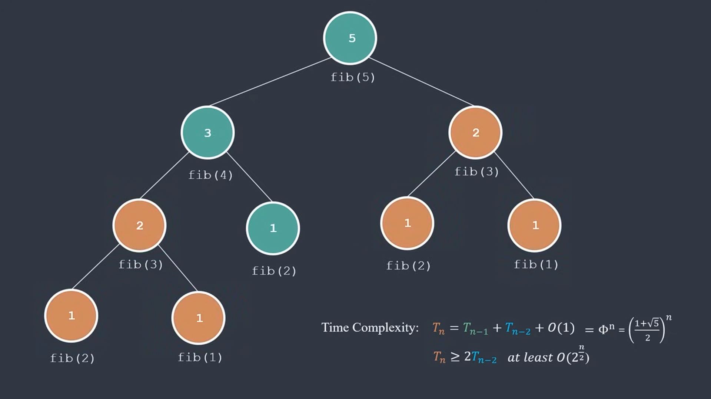

# Dynamic Programming

## Credit & Overview
Video author: [Tech with Nikola](https://www.youtube.com/@TechWithNikola), [Link to video](https://www.youtube.com/watch?v=Hdr64lKQ3e4&ab_channel=TechWithNikola)

2 common use-cases:
- Find an optimal solution (find max, min).
- Count the total number of solutions.

Dynamic programming is about identifying and solving all subproblems.

To understand the following code better, you can print out everything for better visualization.

## Popular Problems
### N-th Fibonacci Number
Write a function that returns n-th Fibonacci number.
F1 = F2 = 1
Fn = F(n - 1) + F(n - 2)

Basic but very slow solution:
```
def fib(n):
    if n <= 2:
        result = 1
    else:
        result = fib(n - 1) + fib(n - 2)
    return result

fib(5) # -> 5
```
From the following image, we can see that fib(3) has been calculated twice (computing value) when it can be done only once. This problem can be solved with memoization (remember in Latin), by storing that value in a dict called 'memo'. <br>


```
memo = {}

def fib(n):
    if n in memo:
        return memo[n]
    if n <= 2:
        result = 1
    else:
        result = fib(n - 1) + fib(n - 2)
    
    memo[n] = result
    return result
```
This code is fast, but costs a lot of memory, we only need the last 2 values because Fn = F(n - 1) + F(n - 2). We can use a for loop instead of recursion.
```
def fib(n):
    memo = {}
    for i in range(1, n + 1):
        if i <= 2:
            result = 1
        else:
            result = memo[i - 1] + memo[i - 2]
        
        memo[i] = result
    return memo[n]
```
Now our solution is efficent, fast and doesn't take up much memory.

## Coin Problem
### Minimum coins
Given a set of coin values `coins = {c1, c2, ... , ck}` and a target sum of money `m`, what's the minimum number of coins that form the sum of `m`?

Basic but slow solution:
```
def min_ignore_none(a, b):
    '''Ignore subproblem that doesn't have a solution because it has negative value.'''

    if a is None:
        return b
    if b is None:
        return a
    return min(a, b)
    

def minimum_coins(m, coins):
    if m == 0:
        ans = 0
    else:
        ans = None
        for coin in coins:
            if m < coin:
                continue # skip solution that has negative value

            subproblem = m - coin
            ans = min_ignore_none(ans, minimum_coins(subproblem, coins) + 1)
            
    return ans
```

Again, recursive is slow so we can use memo dict again for a faster solution. We only need to adjust minimum_coins() function.
```
memo = {}
def minimum_coins(m, coins):
    if m in memo:
        return memo[m]
    if m == 0:
        ans = 0
    else:
        ans = None
        for coin in coins:
            if m < coin:
                continue
            subproblem = m - coin 
            ans = min_ignore_none(ans, minimum_coins(subproblem, coins) + 1)

    memo[m] = ans
    return ans

```

Here's a more efficent solution, that doesn't cost much memory.
```
def minimum_coins(m, coins):
    memo = {}
    memo[0] = 0
    for i in range(1, m + 1):
        for coin in coins:
            if i < coin:
                continue
            subproblem = i - coin
            memo[i] = min_ignore_none(memo.get(i), memo.get(subproblem) + 1)

    return memo[m]        
```

### How Many Ways
Given a set of coin values `coins = {c1, c2, ... , ck}` and a target sum of money `m`, in how many ways can we form the sum `m` using these coins?

```
def ways(m, coins):
    memo = {k : 0 for k in range(m + 1)} # create a dict where default value for any missing key is set to 0.
    memo[0] = 1

    for coin in coins:
        for i in range(1, m + 1):  
            subproblem = i - coin 
            if subproblem < 0:
                continue  
            memo[i] = memo[i] + memo[subproblem]

    return memo[m]
```
`memo[i]` : number of ways to make the amount i (money) using the coins. <br>
`memo[subproblem]` : number of ways to make the remaining amount subproblem using the coins. <br>

**Small example**: we need to make the amount 5 cents, we have a coin worth 3 cents, we can:
- Use the 3 cent coin (1 way), find number of ways to make the reamining 2 cents (subproblem).
- Add number of ways to make 2 cents to the number of ways to make 5 cents. This is combining the 3 cent coin with ways to make 2 cents.

**A little extra from me**: what if we're asked what's the solutions for each way or we're also given `k` for number of coins that we're only allowed to exchange to?

We can create another dict to store the solutions.

```
def ways(m, coins):
    memo = {k : 0 for k in range(m + 1)}
    memo[0] = 1
    solutions = {k : [] for k in range(m + 1)} # create a dict to store the solutions for each value
    solutions[0] = [[]] # the solution for 0 is an empty list

    for coin in coins:
        for i in range(1, m + 1):  
            subproblem = i - coin 
            if subproblem < 0:
                continue  
            memo[i] = memo[i] + memo[subproblem]

            if memo[i] > 0: # only pick the valid solution ( != 0 )
                # Add the current coin to all the solutions for the subproblem
                for solution in solutions[subproblem]:
                    solutions[i].append(solution + [coin])

    return memo[m], solutions[m]
```

But in my opinion, this solution is still slow because there're still 3 test cases left that I haven't been able to pass. If you have a faster solution, please make a pull request, I would love to test it out.

## Maze Problem
Given an NxM grid, in how many ways can a rabbit get from the top-left to the bottom-right corner if it can only move down or right?

```

```


```

```


